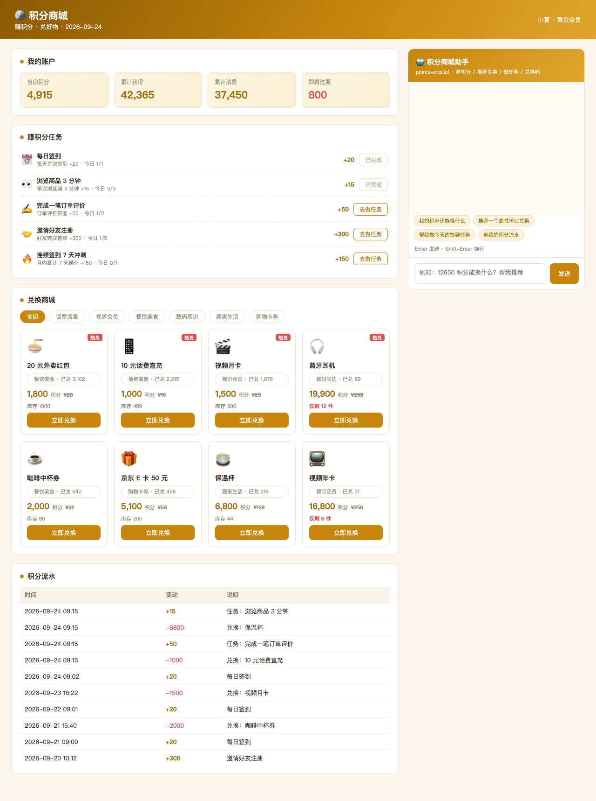
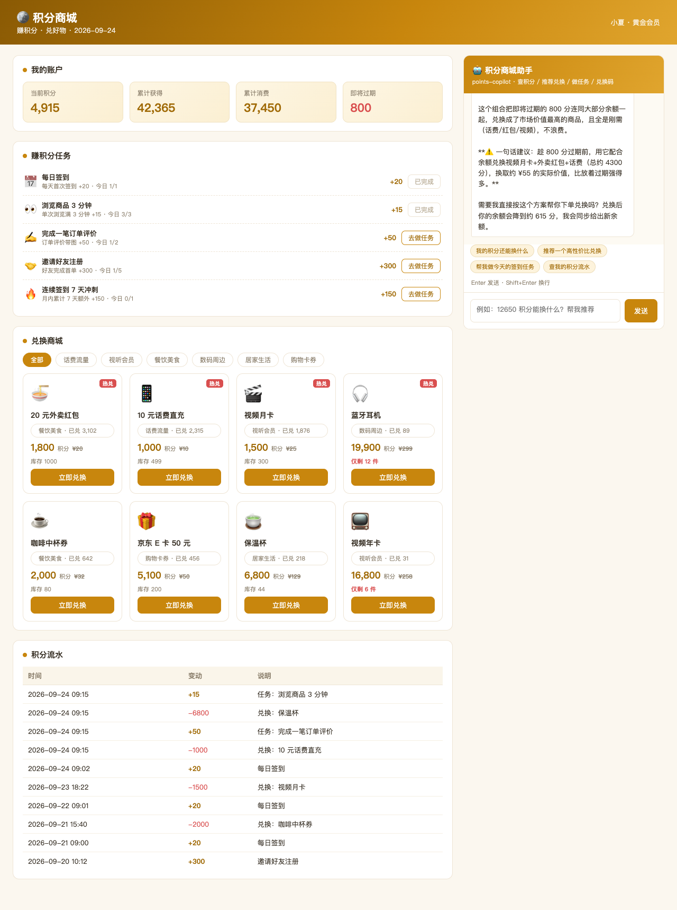
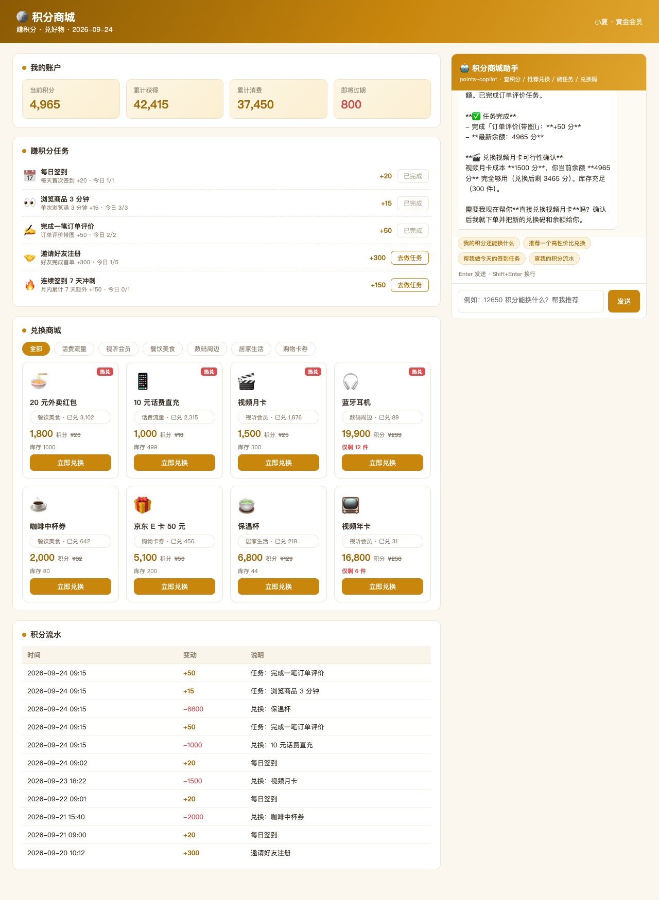

# points-mall · 积分商城（DSH Java Native 插件场景案例 P51）

> 基于 **deepseek-harness-java（DSH）Java Native 插件机制** 的积分运营场景案例：积分账户（余额/等级/过期提醒）+ 赚分任务（签到/评价/邀请）+ 兑换商城（话费/会员/数码/卡券）+ 积分流水，通过 `points-copilot` 插件接入 AI 助手，支持自然语言查积分、要推荐、做任务、下兑换单（含兑换码）。



## 一、项目组成

| 模块 | 说明 |
|------|------|
| `points-app` | Spring Boot 3.2 应用（端口 **18090**），积分 REST API 与前端页面 |
| `points-plugin` | DSH Java Native 插件（`points-copilot`），打包 5 个 AI 工具 |

业务数据：3 个账户（黄金/白银/铂金）、8 款商品（热兑标记 + 库存紧张场景）、5 类赚分任务（每日上限）、真实流水（签到/邀请/兑换）。

## 二、插件工具（5 个）

| 工具 | 说明 |
|------|------|
| `points_account` | 积分账户：余额、等级、累计获得/消费、即将过期 |
| `goods_list` | 商品列表：成本/库存/已兑量/市场价，可按分类过滤、只看热兑 |
| `goods_redeem` | 积分兑换：校验余额与库存，返回兑换码与兑换后余额 |
| `task_ops` | 赚分任务：list 查任务 / do 完成任务（每日上限校验） |
| `points_ledger` | 积分流水（加分/扣分明细）与兑换记录（含兑换码） |

## 三、REST API

| 方法 | 路径 | 说明 |
|------|------|------|
| GET | `/api/account?userId=` | 积分账户 |
| GET | `/api/goods?category=&hot=` | 商品列表 |
| POST | `/api/redeem` | 兑换 `{userId, goodsId, quantity}` |
| GET | `/api/redeems?userId=` | 兑换记录 |
| GET | `/api/tasks` | 任务列表 |
| POST | `/api/task/do` | 完成任务 `{userId, taskId}` |
| GET | `/api/ledger?userId=` | 积分流水 |
| GET | `/api/overview` | 商城概览 |
| POST | `/api/assistant/stream` | AI 助手 SSE（透传 DSH） |

## 四、快速开始

```bash
mvn clean package -DskipTests
java -Dserver.port=18090 -jar points-app/target/points-app-1.0.0-SNAPSHOT.jar

bash install_plugin.sh points-plugin/target/points-plugin-1.0.0-SNAPSHOT.jar \
  points-copilot 1.0.0-SNAPSHOT points-plugin-1.0.0-SNAPSHOT.jar "积分商城助手"

open http://127.0.0.1:18090/
```

## 五、端到端验证

```bash
bash agent_stream.sh 127.0.0.1:8090 points-copilot "我现在有多少积分？能换什么？推荐一个最值的"
bash agent_stream.sh 127.0.0.1:8090 points-copilot "帮我兑换保温杯，看下兑换码和最新余额"
bash agent_stream.sh 127.0.0.1:8090 points-copilot "帮我做一次浏览商品任务，再查积分流水"
```

验证截图：

| 截图 | 内容 |
|------|------|
|  | AI 结合过期分给出兑换组合建议 |
|  | 页面一键兑换保温杯成功 |
|  | AI 完成评价任务 + 校验视频月卡可兑性（先确认后下单） |

## 六、技术要点

- **兑换安全约束**：系统提示词要求「兑换前必须确认余额、报出成本与差值；积分不足不强行兑换」——实测 AI 在兑换月卡前主动做了可行性校验并向用户确认。
- **性价比模型**：AI 按 `市场价 / 积分成本` 计算每分价值，给出单件最优 + 组合最优两档建议。
- **过期提醒**：账户带 `expiringSoon` 字段，AI 主动提示优先消耗临期积分（小面额热兑商品）。
- **插件三件套**：`META-INF/plugin.yaml` + SPI 声明 + provided 依赖，一次构建激活通过。

## 七、目录结构

```
points-mall/
├── pom.xml                    # 父 pom（maven.compiler.parameters=true）
├── points-app/                # Spring Boot 应用 (18090)
│   └── src/main/java/cn/xiaofuge/points/app/
│       ├── PointsApplication.java
│       ├── PointsStore.java      # 账户/商品/兑换/任务/流水
│       ├── PointsController.java # REST API
│       └── AssistantController.java # SSE 透传 DSH
├── points-plugin/             # DSH 插件 (points-copilot)
│   └── src/main/
│       ├── java/.../PointsPlugin.java  # 5 工具
│       └── resources/META-INF/         # plugin.yaml + SPI
└── docs/
    ├── 使用说明.md
    └── screenshots/           # 验证截图 ×4
```
